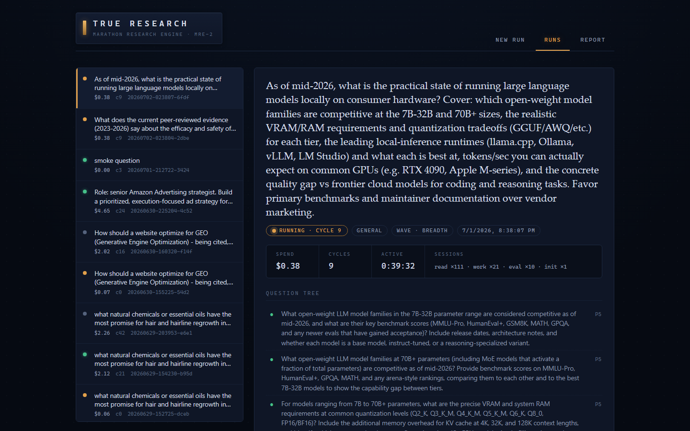
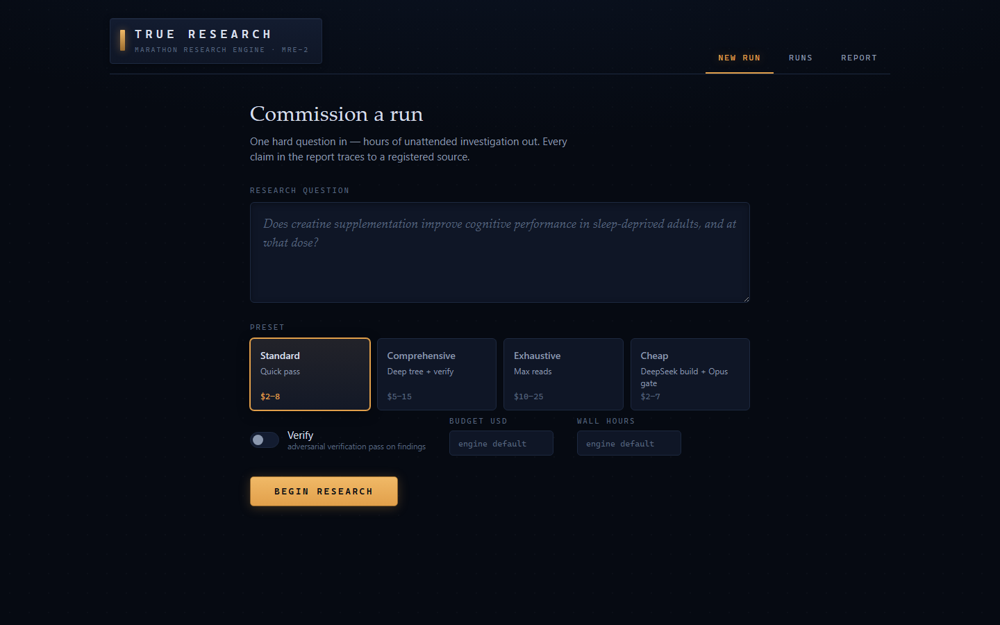

# True Research

**Deep research that goes deeper.** One hard question in; a multi-hour, fully
source-traceable, adversarially-verified report out — for a few dollars a run.

True Research is a local, autonomous deep-research engine. It doesn't do a
5-minute search-and-summarize: it decomposes your question, runs many short
amnesiac Claude Agent SDK sessions against state held on disk, follows leads,
cross-validates sources, refuses to conclude until an independent evaluator
passes, and writes a report where **every claim resolves to a real source it
actually read** — with verbatim quote anchors and an adversarial verifier that
tries to *refute* each load-bearing finding before it ships.

The "hours" are a property of a deterministic driver loop, not any single model
context: **the folder is the memory, the loop is the hours, the evaluator is
the conclusiveness.**



## What makes it different

- **Every claim is traceable.** A finding cites `[src-…]` ids that must resolve
  against a source registry of pages the engine *fetched and read* — not search
  snippets. Sources carry engine-verified verbatim excerpts, so a citation
  points at checkable evidence, not just a URL.
- **It's adversarial about its own findings.** A separate default-FAIL evaluator
  grades the whole state each cycle and re-opens questions where it finds gaps or
  contradictions; an independent verifier then gathers *fresh* evidence to try to
  refute each load-bearing claim. Refuted claims are demoted in the report.
- **It's honest when the evidence is thin.** If it can't source an answer it says
  "not found in the sources reviewed" instead of fabricating — a behavior it
  demonstrates in every real run in [EVIDENCE.md](EVIDENCE.md).
- **It's cheap and portable.** A full comprehensive, verified report typically
  runs **$2–5** on the cost-optimized preset (real ledger: a 24-cycle, 323-page,
  97-source report cost **$4.65**). Pure-Python; no Docker required.
- **It's resumable and unattended.** Runs survive `kill -9`, a closed terminal,
  crashes, and network blips — a supervisor auto-resumes from disk until the run
  finishes.
- **It has a UI.** A zero-build local web app to launch runs, watch the question
  tree and findings resolve live, and read the cited report.

## Quick start

```bash
python -m venv .venv
.venv/bin/pip install -e .            # Windows: .venv\Scripts\pip install -e .
cp .env.example .env                  # add your ANTHROPIC_API_KEY (one key is enough)
true-research "your hard research question"
```

That runs on the default all-Anthropic posture with a conservative **$2 budget
cap** — enough to see a complete, cited (if shallower) report. For a full deep
run, raise the cap or use a preset:

```bash
true-research "…" --comprehensive --verify --max-budget-usd 12   # deep, all-Anthropic
true-research "…" --cheap --gate opus --comprehensive --verify   # ~$3–5, DeepSeek volume + Opus gate
```

### The web UI

```bash
true-research ui         # serves http://127.0.0.1:8787 and opens your browser
```

Launch runs from a form, watch them live (spend vs budget, the question tree
resolving, findings with VERIFIED/REFUTED badges, the decisions log), and read
the finished report with clickable citations and a PDF download.



### Unattended / long runs

```bash
true-research run "…" --comprehensive --verify --detach   # survives closing the terminal
```

`run` supervises the driver and auto-resumes on any non-finished exit until the
run reports finished. `--detach` puts the whole supervisor in the background.

## How a run works

1. **Initializer** decomposes the question into a plan + a tree of prioritized
   open questions.
2. **Each cycle:** a fresh **worker** takes the top open question, searches,
   reads whole pages (not snippets), and registers every source it used; a fresh
   **evaluator** (default-FAIL) grades the entire body of findings and opens new
   questions where it finds gaps or contradictions. This is how depth accrues.
3. Before finishing, an independent **verifier** tries to refute each
   load-bearing finding with fresh sources.
4. The loop exits **only** when the evaluator passes and no questions remain
   open (`conclusive`) — or a circuit breaker (budget / wall-clock / cycles),
   the stall guard, or question-exhaustion trips it.
5. The **synthesizer** always writes `REPORT.md` + `REPORT.pdf` — partial if the
   run ended early — with every claim citing a `[src-…]` id that resolves against
   `sources.json`, plus a limitations/decisions section.

Every run lives in `runs/<id>/` (gitignored): the question, plan,
`open_questions.yaml`, `findings/`, `sources.json`, `verdicts/`, `PROGRESS.md`
(with a DECISIONS log), `ledger.json` (cost per session per endpoint), and the
report. Nothing is held only in memory.

## Presets & cost

Budgets are **hard ceilings**, not estimates — a run stops cleanly and writes a
partial report when it hits one. Actual spend is usually well under the cap.

| Invocation | Posture | Budget cap | Typical real spend |
|---|---|---|---|
| `true-research "q"` | all-Anthropic, safe default | $2 | ~$2 (may be partial) |
| `--comprehensive --verify` | all-Anthropic, deep | $25 | $8–15 |
| `--cheap --gate opus --comprehensive --verify` | DeepSeek volume + Opus gate | $2 (raise it) | **$3–5 full** |
| `--exhaustive` | max read depth | $15 | $10–20 |

Real ledger example: `--cheap --gate opus --comprehensive --verify` on a hard
Amazon-advertising strategy question ran **24 cycles, read 323 pages, kept 97
sources, and concluded for $4.65** (see [EVIDENCE.md](EVIDENCE.md)).

The default cap is intentionally low so a first run can't surprise you with a
bill. The `--cheap` preset needs a `DEEPSEEK_API_KEY`; everything else needs
only `ANTHROPIC_API_KEY`.

## Profiles

`--profile general|scientific|visual` swaps the worker's tools and the
evaluator's rubric, never the loop:

- **general** (default) — web search + reader fan-out; rubric weights breadth,
  source diversity, recency.
- **scientific** — adds PubMed / OpenAlex / arXiv search; rubric demands evidence
  tiers, primary sources, and n / effect-size / CI on load-bearing claims, and
  flags retracted or non-DOAJ venues.
- **visual** — adds page capture (Playwright screenshot + vision analysis) for
  questions about imagery/layout; needs `pip install -e ".[full]" && playwright
  install chromium`.

## Search & backends

- **Search is portable.** With a `SERPER_API_KEY` it uses Google (Serper);
  otherwise it falls back through SearXNG (if configured) to DuckDuckGo — no
  Docker, no key required to get started. Academic profiles also query OpenAlex.
- **Hybrid / local.** Any role can point at a local Ollama endpoint (≥ 0.14,
  which serves the Anthropic API natively) via `--volume local` or an example
  config in `docs/examples/`. Local sessions ledger `$0` with real token counts.
  See `docs/examples/config.local-hybrid.yaml` and `docs/RUNBOOK.md`.

## Evidence

[EVIDENCE.md](EVIDENCE.md) documents real end-to-end runs — cost, page counts,
what got verified, and where the engine honestly declined to answer — plus the
methodology for comparing against hosted deep-research services.

## Architecture

- `driver.py` — the deterministic loop; zero prompts, zero model calls of its own
- `src/sessions/` — the cognition: one module per session role + the SDK wrapper
- `src/profiles/` — swappable domain profiles (tools + rubric + guidance)
- `src/tools/` — connectors: web/academic search, page capture, PDF
- `src/launcher.py` — cross-platform detached launcher + auto-resume supervisor
- `src/webui/` — the local web app (FastAPI backend + zero-build frontend)
- `src/{settings,state,runspace,ledger}.py` — config, schemas, atomic run state,
  cost accounting
- `tests/` — 288-test pytest suite; CI runs it on Linux + Windows (3.11 & 3.13)
- `CLAUDE.md` — the full build specification and design invariants

## License

MIT — see [LICENSE](LICENSE).
